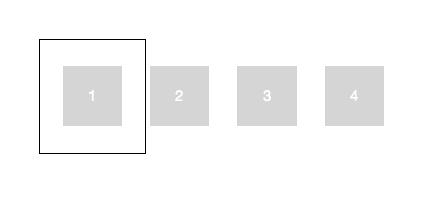
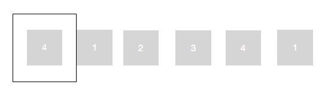
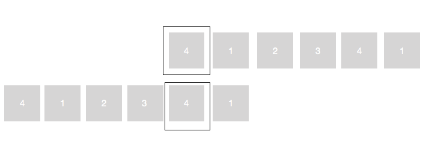

# carousel

### 无限轮播组件

[预览](https://yomaris.github.io/carousel/carousel.html)

#### 功能
1. 点击左右按钮实现页面切换（下一页·上一页）
2. 点击页面下排按钮实现页面的切换
3. 页面自动切换，当鼠标悬停在页面时，页面停止自动切换

#### 原理

假设有四个页面需要展示，当前页为1

用js将1和4克隆，变为下图

将包裹页面列表的容器绝对定位，通过改变left的值来展示不同页面。

当向前移动到4时，把当前的4替换为另一个4，如图所示，left设为让另一个4显示的值

同理，向后移动到1时，将当前的1替换为另一个1。

